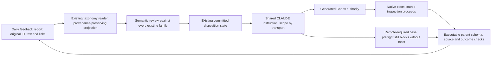

# Feedback prevention case model

Scope: AES owns report production, native parent checks and canonical instructions; agent-skills owns the taxonomy reader and dispositions. This extends the existing [subagent model](../aes-subagent-feedback/SYSTEM_MODEL.md), not its producer contract.

All edges are claims until the named feedback-prevention-v1 trace shows the exact source record, actual semantic review, committed disposition, authority reads, source inspection or remote stop, and parent receipts. Private transcript/result bytes stay in the existing private verification log; this model contains no copied private report. The original inconclusive child must fail the native-positive check. Matching hashes prove identity only. Existing licensing and recurrence processes are unchanged; this case does not establish universal prevention.
