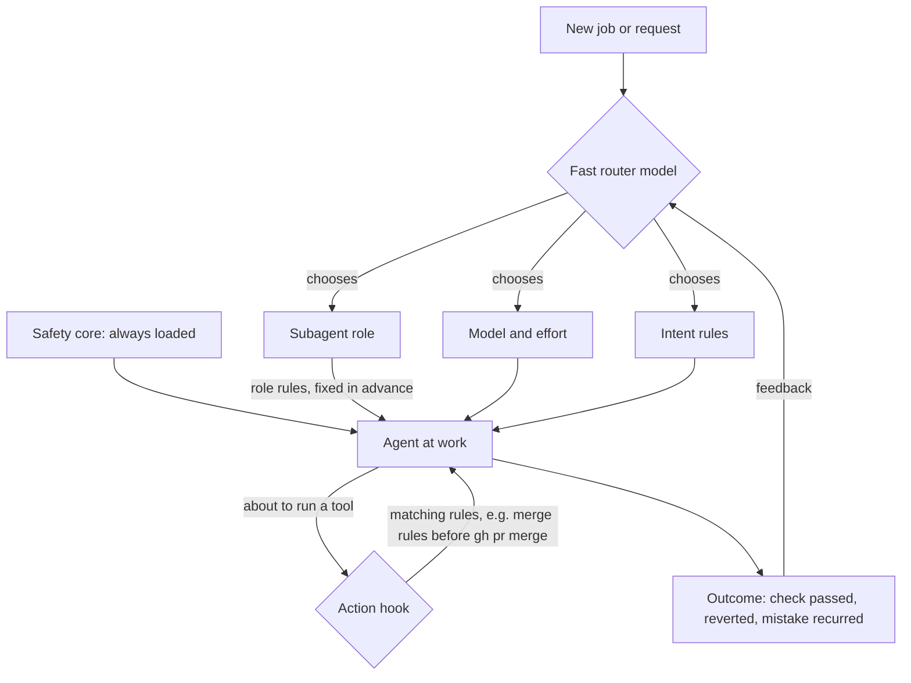

# Agent router: a fast model chooses the agent, its rules, its model and its effort

Status: adopted 2026-10-09; profile/accounting core merged in [PR #497](https://github.com/BrianMills2718/agentic-engineering-system-canonical/pull/497), while runtime acceptance remains pending. [PLAN.md](PLAN.md), its [adoption decision](receipt.adoption-decision.json), [receipt](receipt.json) and [generated goal](agent-router.goal.md) govern completion. All eight complete criteria remain planned in the [acceptance records](evidence.json). The [revision goal](revision.goal.md), [route](revision-path-decision.json) and [verification](verification.log) retain the earlier document-only evidence. The [offline inventory check](inventory-check.json) binds all 263 current source IDs: 229 keep, 27 covered and 7 retirement candidates. Complete policies, named quotations and validated applicability remain privately recoverable; the [public manifest](../../docs/rules/legacy-dispositions.yaml) exposes structural outcomes and evidence hashes. No further paid sorting is authorized by the exhausted legacy allowance; mandatory instructions are neither retired nor activated by the inventory.

The executable checkpoint provides [portable profile validation](../../scripts/rules/agent_router.py), [profile and handoff schemas](../../contracts/agent-router/profile.v1.schema.json), 20 focused checks, and an [authentic historical ledger consumer](native-handoff-replay.json). A [fresh unsuccessful handoff](native-handoff-role-mismatch.json) reached the existing feedback collector with its failed checker and corrected inconclusive verdict. The shared collector now also [recovers a real interrupted Claude child result](claude-feedback-capture.json); its structurally checked, inconclusive record reaches the weekly feedback reader. This result corrects the earlier missing-child interpretation: the native child finished, while the old collector failed to join and read it.

The [deployed collector check](deployed-collector-check.json) observes that repair in the actual runtime refreshed to PR #499's merge. The inventory exporter preserves full source evidence outside public Git checkouts and publishes an explicit field allowlist. The existing 33 published rule texts and enforcement fields remain unchanged; their applicability tags are inventory metadata, with already-withdrawn rules excluded. Both the full private register/page and public manifest/page passed authentic consumer checks. Known historical cache metadata totals $6.278699276120 with 27 attempts missing cost; this is not provider-billing reconciliation or complete attribution. The offline inventory made no new paid sorting or adoption calls. [Project Meta #2503](https://github.com/BrianMills2718/project-meta/issues/2503) retains the separate disposition of older public source refs; no history was deleted.

The harness owner's [current research and native observations](../harness-context/subagent-research.md) include the paid Claude parent/child checks and native Codex observations. Neither establishes the complete four-cell ordinary/fallback gate. Native router dispatch, live profile differences, independently checked routing outcomes and the observation periods remain pending. The separate Claude testing authority does not renew legacy sorting or authorize a source-job canary, a new paid adoption, or automatic routing.

Check the collector repair with the repository interpreter: `python -m pytest tests/learning/test_subagents.py -v`. Continue using required baseline instructions and existing native handoffs until the runtime gates pass.

## What Brian asked for

Brian, 2026-10-08:

- "i am thinking that we could use a system one model to figure out what policies are relevant to an agent at any one point and inject them on demand"
- "the other thing i think we need to think about is subagents"
- "yes and then we can also use a system 1 model for choosing subagents, any additional injected context, model and effort level"

## The idea in one example

Brian asks for a broken dashboard page to be fixed. Today the coordinating agent decides, by habit, to do it itself on its own (large) model, carrying the whole workspace instruction file (40,000+ characters), most of it irrelevant to the job.

With the router, before the work is handed out, a fast model reads the job and returns four choices:

| Choice | For this job |
| --- | --- |
| Subagent | `frontend` for the page, then `reviewer` for the check |
| Extra rules | tooltips on every control; search the UI index first; no red against green; verify in a real browser |
| Model | a mid-size model for the frontend work; a small one for the review checklist |
| Effort | medium; high only if the first attempt fails its check |

When the frontend agent later runs `gh pr merge`, a hook adds the three merge rules at that moment, whoever is running it.

Afterwards the outcome (did the check pass, was it reverted, did the same mistake recur) is recorded, and the router's choices shift towards what actually worked.

## Four layers of rules

A model that picks rules can miss one, so it is the last layer, not the only one. The diagram is a proposed steady state after the canary, delivery and fallback gates pass; it is not evidence that those gates have run.

| Layer | Decided by | When | Example |
| --- | --- | --- | --- |
| Safety core | fixed | always | never restart WSL; never publish private data; never send outward without approval |
| Role | the subagent's definition | when the subagent is created | frontend gets the UI rules |
| Action | a hook before a tool call | at the moment of the action | merge rules before `gh pr merge` |
| Intent | the fast router model | on each new job | "lead with a concrete example" when Brian says he does not understand |

Subagents start without the parent's conversation, so a rule the parent was given does not reach them unless the role, the handoff or a hook carries it. Delivery must be observed separately in Claude parent, Claude child, Codex parent and Codex child transcripts. Unsupported action hooks require a verified role/handoff route and retained baseline context; no layer is presumed to reach every client.

## What already exists (reuse, do not rebuild)

| Piece | Owner | State on 2026-10-08 | Use here |
| --- | --- | --- | --- |
| Model and effort chosen by a fast model, learning from checked outcomes | llm_client [Plan #379](https://github.com/BrianMills2718/llm_client/blob/main/docs/plans/379_system_one_feedback_router.md) | adopted design; implementation in progress (Codex session, claim `llm_client:system-one-router`); first consumer is OntoCanon extraction | reuse its selector and feedback store for the model and effort choice; coding-agent jobs become a second consumer |
| Specialist subagents that load only their role's rules | AES [harness-context](../harness-context/README.md) | shaping; one investigator canary | the role layer; the router chooses among these specialists |
| The rules, with how each is enforced | AES [rules register](../../docs/rules/register.yaml) and [page](../../docs/rules/RULES.md) | merged 2026-10-08 (#457) | the source the router and hooks read; each rule gains a "when it applies" field |
| A hook that enforces one rule at the moment of action | agent-skills Jev gate rule M1 (#453) | enforced | the pattern for the action layer |
| Native dispatch with model and effort | Claude Code's Agent tool takes `subagent_type`, `model` and `effort`; Codex support is resolved from its native capability list | available | the router's output fills these fields; no new runtime |
| Deterministic-first routing | ideas register: onto-canon sense router resolves 78% of cases by rule, calls a model for the rest | pattern | the router tries fixed rules first and calls a model only for the remainder |

Not documented anywhere before this page as one idea: the router choosing all four (subagent, rules, model, effort) for coding agents.

## Slices

1. **Rule tags and legacy sort** (approved by Brian 2026-10-08). Sort project-meta's 263 legacy rules into already covered, keep or retire; give every kept rule a `applies_when` field: `always`, `roles: [...]`, `actions: [tool-call patterns]` or `intent: <description>`.
2. **Action hook.** One hook, before each tool call, injects the rules whose `actions` pattern matches. First check that it also fires inside subagents in Claude Code and Codex; if it does not, that gap is the first finding. Start with merge, commit, UI file edits and Python environment setup.
3. **Router in observe mode.** When an agent hands out work, the fast model proposes subagent, extra rules, model and effort, and the proposal is logged beside what the agent actually chose. Nothing is enforced yet. This measures disagreement and reliability. Every eligible handoff stays in the denominator, including invalid, capped, failed, unsupported and missing-input proposals; outcome completeness is reported separately.
4. **Bounded canary, then a routing proposal.** Shadow agreement selects cases; it cannot prove an unexecuted outcome. A separately authorized, small reversible canary executes incumbent and candidate choices against frozen independent task checks. Only supported fields can then be proposed for an authorized rollout, with fallback and joined outcome feedback.

## How we will know it works

- Mistakes the feedback loop counts recur less often once their rule is injected by role, action or intent, compared with the weeks it sat in the big instruction file.
- The instruction text an agent carries at the start of a job shrinks, measured from client traces, not estimated from file sizes.
- Cost per finished job does not rise: smaller models and lower effort where they pass their checks pay for the router's calls.

## Decisions taken (wrong-when conditions)

- **The safety core is never left to the router.** Wrong when: an always-loaded rule is shown to cost more context than the misses it prevents, measured over a month of traces.
- **Model and effort reuse llm_client Plan #379, not a second selector.** Wrong when: #379's selector cannot take a coding-agent job as a consumer without changing its contract; then this plan proposes the change there rather than forking.

## Required rules and colleague configuration

Before shrinking instructions, map every required rule to its delivery, deterministic gate and fallback for all four client/agent cells. Retain baseline context wherever coverage is unproven. The router cannot waive required rules or bypass existing gates.

Portable profiles configure policy sets, required controls, specialist lists, native model/effort mappings, budgets, mode/off switch and workspace/log roots without code forks or personal path assumptions. Record the effective profile and native capability snapshot with each handoff. Configuration narrows authority; it does not grant new spend.

The public inventory source at `8aa680e` passed `make check`: 386 tests passed, one skipped, no failures or errors; mypy reported no issues in 22 source files, exit 0. The 19 focused regressions and 11 authentic inventory checks passed; [the local gate receipt](local-check.json) records the executed source and timing.
