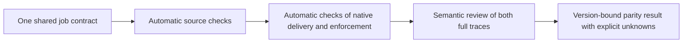

# Workflows, compact Codex sessions, and automatic behavior checks

Use each client's native orchestration, keep one shared behavior contract, and check both delivered instructions and subsequent decisions. This refresh corrects the [earlier research](../../subagent-research.md): it omitted Claude's dedicated dynamic Workflows feature, and its tested Codex child does not establish a universal instruction-loading limit.

**Checked 2026-10-09; installed Claude Code 2.1.295 and Codex 0.162.0.** These are documentation, pinned-source and saved-trace findings. No Workflow was activated and no new model execution was used for this refresh. [Evidence](workflow-and-parity-evidence.json).

## Claude's Workflow feature and Codex's related capabilities

Imagine checking 20 files. A script sends a file to each worker, keeps their reports in variables, and returns one combined answer. The main conversation need not receive every intermediate report.

Claude's dynamic Workflows provide this script runtime. JavaScript coordinates `agent()`, `parallel()` and `pipeline()`; intermediate results stay outside the main context. Runs are inspectable through `/workflows`, resumable within a session, and reusable from project/personal workflow directories or plugins. The script cannot directly access files or a shell; workers perform those operations. Workers remain subject to session permission and sandbox checks. Failure/replay can repeat work, so context isolation does not guarantee lower total cost. [Official Workflow documentation](https://code.claude.com/docs/en/workflows).

Codex's documented subagent workflows let the parent spawn, steer and collect parallel workers. Its SDK and app-server provide programmatic thread control and streamed events. These support related coordination needs; the sources inspected here do **not** establish an equivalent built-in JavaScript Workflow runtime. This is a bounded comparison, not a claim that no Codex equivalent exists. [Subagents](https://learn.chatgpt.com/docs/agent-configuration/subagents), [SDK](https://learn.chatgpt.com/docs/codex-sdk), [app-server](https://learn.chatgpt.com/docs/app-server).

**Adoption consequence:** consider native Claude Workflows before building script orchestration. Reuse native Codex delegation or its existing thread API for the corresponding job. Keep the shared obligations independent of either orchestration format; execution parity still needs evidence.

## Codex can have a smaller starting instruction packet

The tested fresh child inherited its parent's user/thread instruction snapshot even with no conversation history. Repository-discovery limits cannot erase that snapshot. This is a property of the inspected child route. [Pinned instruction inheritance](https://github.com/openai/codex/blob/rust-v0.162.0/codex-rs/core/src/agents_md_manager.rs#L150).

An **independent fresh** `codex exec` or `thread/start` avoids that parent snapshot. With `project_doc_max_bytes=0`, repository discovery stops; host/global instructions still load. Supply compact specialist instructions and the required authority packet through the existing native entrypoint. A compact coordinator can also pass its already compact snapshot to a child. Both are source-supported candidates; neither has a fresh 0.162 execution certificate here. [Repository loader](https://github.com/openai/codex/blob/rust-v0.162.0/codex-rs/core/src/agents_md.rs#L58), [thread API](https://github.com/openai/codex/blob/rust-v0.162.0/codex-rs/app-server-protocol/src/protocol/v2/thread.rs#L62), [existing entrypoint](https://github.com/BrianMills2718/agent-skills/blob/main/README.md).

Keep the normal configuration and hooks. An empty alternative home would also remove unrelated controls and cannot demonstrate equivalent behavior. Do not infer that a role setting is applied: pinned child-role overrides accept only a subset of configuration fields. [Role adapter](https://github.com/openai/codex/blob/rust-v0.162.0/codex-rs/core/src/agent/role.rs#L33).

## Synchronization has automatic checks and semantic review

| Layer | What to check | Existing owner to extend |
| --- | --- | --- |
| Shared source and rendered files | Contract/schema validity, projection digests, declared tool and hook mappings | Agent Skills specialist renderer and client-config checks |
| Actual delivery and enforcement | Parent/child identity, execution-ready instruction and tool snapshots, effective permissions, hook eligibility plus real execution receipts, context usage | AES subagent collector and handoff contracts; native Codex `hooks/list` |
| Decisions and results | Correct authority read, evidence used, justified conclusions, allowed actions, honest limitations | Full paired-trace review and bound parent-check receipts |

A delivery receipt should carry contract/revision digests, native parent/child/call IDs, instruction and tool observations, permission and hook evidence, context measurements, and exact trace offsets. Compare each client against shared obligations. Missing material evidence is **inconclusive**. Exact wording and vendor-specific tool names need not match.

File-only checks are cheap but miss inherited settings. Delivery checks detect those differences; semantic review requires more reading but can catch unsupported conclusions. A new common runtime would add another system to maintain. Extending the existing native adapters and collector is the smaller option.

This is already partly testable without another model call: the saved Claude execution-ready snapshot contains the compiled specialist body exactly and lists precisely `Read`, `Grep`, `Glob`. The final native child result also matches the forwarded result by hash. Those checks establish delivery and attribution; they do not certify every permission or conclusion.

The existing collector nevertheless classifies this completed child as unresolved at the inspected PR497 revision. Its Claude enrichment returns early and its parent-call binding misses the child identity. The owning coordinator is repairing that reproduced collector defect from saved traces; no paid rerun is required. [Existing collector](https://github.com/BrianMills2718/agentic-engineering-system-canonical/blob/6329a23671629acc659f89dadb96c00da8b822d9/scripts/learning_loop/subagents.py#L227).

Semantic review adds a different check. The child's JSON can be structurally valid while its causal narrative places the maintenance target at line 325; the frozen target is at line 314, and line 325 starts its recursive command. It also asserts an absent inherited environment value while acknowledging that value is unknown. Preserve the original answer and qualify those claims. Classify failures as evidence unavailable, evidence returned but unused, or an incorrect expectation; cite exact events and source lines. [Native result](child-result.json), [frozen source](../input/project-meta/Makefile#L314).

**Smallest next implementation:** add the existing specialist projection check to daily parity, extend the existing collector with native delivery receipts, then compare the saved paired traces against the contract and review their conclusions. This reuses the current owners and requires no new dispatcher or broad benchmark. Confidence in this approach is high; complete runtime parity and the compact 0.162 route remain unverified. A false certificate could hide excess authority or context. The design is wrong if a changed required instruction, tool or permission passes without the checks detecting it.
