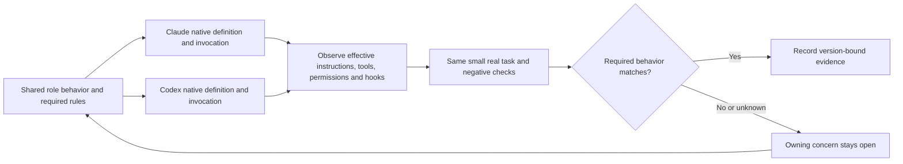

# Claude Code and Codex delegation: current research and behavior parity

Use native workers with an explicit history policy, keep their shared behavior in one source, and verify the effective client settings before claiming parity.

For example, ask an agent to explain why `make maintenance-worktree` refused a command. One worker can receive the error and two source files. Another can receive a copy of the whole conversation. Both might be called a “subagent,” but they start with different information. A separate copy of the repository controls where either can edit; it does not decide what either knows.

**Checked 2026-10-09.** Local version commands returned Claude Code **2.1.295** and Codex CLI **0.162.0**. This is a refresh of the adopted [harness plan](README.md), prompted by Brian's request to establish the different native mechanisms before redesigning the harness. It changes no client configuration. Official documentation is living material; installed source is pinned separately. [Evidence and limitations](subagent-research.evidence.json).

## The choices are independent

| Choice | Concrete question |
| --- | --- |
| Conversation history | Does the worker get only its assignment, or a copy of earlier messages and tool results? |
| Instructions and skills | Which general rules, repository rules and job procedures load before work begins? |
| Tools and permission | Which operations are exposed, and which does the runtime actually permit? |
| Files | Does it share the checkout, use a Git worktree, or run elsewhere? |
| Scheduling and communication | Must the parent wait? Can workers communicate directly, resume, or create workers themselves? |

These choices explain why fresh conversation history can still carry a large instruction bootstrap, and why a background job can still share files with the foreground job. Those are design implications, not measured savings.

## Claude Code: distinct native mechanisms

The first four rows describe subagent execution. The remaining rows add other invocation or coordination shapes.

| Mechanism | Documented behavior | Consequence for this design |
| --- | --- | --- |
| Ordinary/custom subagent | Fresh conversation history; own prompt. Repository/user instructions load by default. `omitClaudeMd: true` suppresses their loading, with managed-policy qualifications; requires 2.1.271+. [Startup](https://code.claude.com/docs/en/sub-agents#what-loads-at-startup) | Compact jobs can use a bounded assignment plus explicit required authority. Omitting instructions alone would lose rules. |
| Foreground or background subagent | Different scheduling and tool availability; background retains MCP access but has a narrower built-in tool pool. [Execution modes](https://code.claude.com/docs/en/sub-agents#run-subagents-in-foreground-or-background) | Declare required tools for the chosen mode. |
| Conversation fork | Inherits parent history, prompt, tools and model. `/subtask` and fork-mode behavior are distinct from fresh custom definitions. [Forks](https://code.claude.com/docs/en/sub-agents#fork-the-current-conversation) | Useful when the existing discussion is necessary; unsuitable as evidence that inherited context shrank. |
| Nested subagents | Supported; default depth three since 2.1.219, configurable. [Nesting](https://code.claude.com/docs/en/sub-agents#let-subagents-spawn-their-own-subagents) | The earlier blanket “cannot nest” assumption is obsolete. Bound the delegation tree deliberately. |
| Skill with `context: fork` | Runs skill content in a **fresh** subagent, without conversation history. Background is normally used, with interactive/noninteractive exceptions. [Skill execution](https://code.claude.com/docs/en/skills#run-skills-in-a-subagent) | The word “fork” here does not mean the full-history fork above. A skill supplies procedure; it is not automatically a persistent specialist. |
| Agent team | Experimental, disabled by default. Teammates are separate sessions: project context loads, leader history does not. They can communicate directly and share tasks. No nested teams. Enabling teams can change ordinary named delegation into teammate creation; `-p`/SDK retain ordinary workers. [Teams](https://code.claude.com/docs/en/agent-teams) | Choose teams for collaboration needs. Their regular project bootstrap is not intrinsically smaller. |
| Independent/background session | `--bg`, `/bg`, and agent view manage full sessions. `--agent` makes a definition the main agent; `omitClaudeMd` is ignored in that use. [Agent view](https://code.claude.com/docs/en/agent-view), [main-agent use](https://code.claude.com/docs/en/sub-agents#use-a-subagent-as-your-main-agent) | A named main session and a child of that name are different loading routes. Native worktrees do not supply Brian's coordination claims. |
| Claude Agent SDK | Programmatic access to the Claude Code engine and agents. TypeScript exposes `omitClaudeMd` at SDK 0.3.271+; Python's documented `AgentDefinition` does not. [SDK agents](https://code.claude.com/docs/en/agent-sdk/subagents) | A possible integration surface, not a reason to build another dispatcher. SDK version and language matter. |

Important authoring details: definitions support tools, model, instructions and skill preloading. A `skills` list preloads content rather than restricting all later skill access. Plugin definitions ignore some controls, including hooks, MCP servers and permission mode. Parent permission modes can override a child's declared mode. [Capability controls](https://code.claude.com/docs/en/sub-agents#control-subagent-capabilities).

SDK instruction loading is another independent setting: current documentation describes user/project settings by default, and explicit `settingSources: []` omits them. A tool's filesystem access remains a separate issue. [SDK prompts](https://code.claude.com/docs/en/agent-sdk/modifying-system-prompts).

## Codex: definitions, invocation modes and sessions

| Mechanism | Current official evidence | Consequence for this design |
| --- | --- | --- |
| Native built-in/custom subagent | CLI/app/IDE support delegation. Custom TOML lives in user/project `agents` directories and requires `name`, `description`, `developer_instructions`. Files act as configuration layers. [Subagents](https://learn.chatgpt.com/docs/agent-configuration/subagents#custom-agents) | A definition describes a role; the spawn route separately determines inherited history. |
| V1 child: fresh or inherited history | Tagged 0.162.0 source uses `fork_context`, default false; true copies parent history. [V1 handler](https://github.com/openai/codex/blob/rust-v0.162.0/codex-rs/core/src/tools/handlers/multi_agents/spawn.rs#L218) | Codex has a native fresh-history route. “Codex needs a standalone session” was too broad. |
| V2 child: fresh or inherited history | Tagged 0.162.0 uses `fork_turns: none/all`, default all. Legacy numeric inputs mean **full history**, not a limited number of turns. [V2 handler](https://github.com/openai/codex/blob/rust-v0.162.0/codex-rs/core/src/tools/handlers/multi_agents_v2/spawn.rs#L278) | Always choose explicitly. Do not infer partial-history support from older source or the field name. |
| Separate new/resumed/forked session | `codex exec` starts noninteractive work; resume continues a stored session; `codex fork`/`/fork` copy one into a new conversation. [Commands](https://learn.chatgpt.com/docs/developer-commands?surface=cli#codex-fork) | New conversation, resumed conversation and copied conversation have different starting states. |
| App worktree chat | A separate checkout for parallel work; Handoff moves work between it and Local. [Worktrees](https://learn.chatgpt.com/docs/environments/git-worktrees) | Filesystem separation does not prove instruction separation or claim ownership. |
| SDK/app-server thread | SDKs start/resume threads; app-server exposes `thread/start`, `thread/resume`, `thread/fork`, and steering. Fork can select a history cutoff. [SDK](https://learn.chatgpt.com/docs/codex-sdk), [app-server](https://learn.chatgpt.com/docs/app-server) | Adopt these only if the native interaction is insufficient; a programmatic thread is not automatically a supervised child. |
| Hosted agents/API orchestration | Agents API runs a managed Codex harness; Responses multi-agent provides another orchestration surface. Their environment/tool rules differ. [Agents API](https://developers.openai.com/api/docs/guides/agents-api/multi-agent), [Responses](https://developers.openai.com/api/docs/guides/responses-multi-agent) | These are adjacent products, not evidence about Brian's installed CLI. |

Custom-agent settings omitted from a file inherit from the parent. Live parent sandbox/approval overrides are reapplied during spawning; a role's `read-only` default can therefore lose to the parent's runtime choice. CLI exposes thread switching with `/agent`. [Effective settings](https://learn.chatgpt.com/docs/agent-configuration/subagents#approvals-and-sandbox-controls).

**Installed versus exposed:** a fresh local `codex features list` returned `multi_agent=true`, `multi_agent_v2=false`. This running session exposes `fork_turns` with `all/none`. They are different runtime surfaces; the CLI default is not proof of the current daemon's tool schema. No feature flag was changed.

Codex instruction discovery loads global guidance and the project-root-to-working-directory chain. [AGENTS discovery](https://learn.chatgpt.com/docs/agent-configuration/agents-md). `project_doc_max_bytes=0` is not equivalent to Claude's suppression setting: tagged source retains supplied user instructions before applying the project-document budget. A history fork can also preserve previously supplied content. [Instruction loader](https://github.com/openai/codex/blob/rust-v0.162.0/codex-rs/core/src/agents_md.rs#L58). Thus **fresh history is necessary for some compact routes but does not prove a small total bootstrap**.

## Skills, plugins and configuration are separate layers

Skills package procedures; plugins distribute skills, agents, hooks or tools. Neither package format guarantees the same runtime behavior across clients. Codex advertises skill metadata first and loads the body when selected; its initial skill catalogue has a context budget. [Codex skills](https://learn.chatgpt.com/docs/build-skills). Claude can preload role skills or run a skill in its own worker. [Claude skills](https://code.claude.com/docs/en/skills).

For synchronization, compare the effective instruction chain, discovered role, available tools, inherited permissions and triggered hooks separately. Codex non-managed hooks require trust, matching hooks can run concurrently, and app-server provides `hooks/list`. [Codex hooks](https://learn.chatgpt.com/docs/hooks), [discovery API](https://learn.chatgpt.com/docs/app-server). Claude's event contracts must be mapped explicitly rather than assuming identical callback payloads. [Claude hooks](https://code.claude.com/docs/en/hooks).

## What Brian already has

These are local observations, not claims made by the vendors.

| Existing owner and mechanism | What was checked | Remaining limitation |
| --- | --- | --- |
| agent-skills: nine canonical role definitions + `sync_agents.py` | `check` returned **9 agents in sync**, exit 0. [Source](https://github.com/BrianMills2718/agent-skills/blob/main/scripts/sync_agents.py) | Renderer explicitly leaves most tools and model untranslated. A Claude-oriented source plus matching prose does not prove equivalent capabilities. |
| agent-skills: semantic investigator contract + client renderer | `--check` returned **1 contract, 2 clients in sync**, exit 0. [Renderer](https://github.com/BrianMills2718/agent-skills/blob/main/scripts/render_specialist_agents.py) | Uses different instruction suppression mechanisms. Current effective loading and permissions still require route-specific observation. |
| Project Meta: `claude-codex-parity` policy and daily concern | Registry inspected: shared instructions, skills, preferences and actually running hooks are covered; partial enforcement is declared. The strict hook checker exited **1**, reporting **17 new single-client entries** and unknown Codex running state. Its later discovery cache reported **13 runnable hooks**, none listed as not running, and no trust healing. [Policy owner](https://github.com/BrianMills2718/project-meta/blob/main/policy/registry.yaml) | These are different checks: a discovery snapshot does not prove every required control is declared or executes correctly. File checks are green; overall parity is **not certified**. The checker schedules a background runtime refresh when its cache is stale. |
| Enforced Planning: claims and mailbox delivery | Research navigation request was stored, but the response reported **delivery unavailable** and an unobserved backlog. | Persistence did not demonstrate delivery. This sender report does not establish the cause or prove the receiver lacks hooks; evidence retains the detecting consumer for follow-up. |

Earlier context measurements remain evidence for their named versions and invocation shapes. They do not establish that current Codex fresh children always inherit a full workspace bootstrap, or that a fresh standalone process is the only compact option. Current documentation/source requires narrowing those earlier conclusions. The [existing review](review-page/index.html) contains the historical canary; this research supplies the current qualification.

Remaining execution work is recorded with its owners: [specialist behavior parity](https://github.com/BrianMills2718/agent-skills/issues/302) updates the historical role-file absence report, and [mailbox sender capability classification](https://github.com/BrianMills2718/enforced-planning/issues/640) retains the new delivery warning with its cause explicitly unconfirmed.

## Recommended synchronization design

Keep one behavioral contract and translate it into each client's native mechanisms. Extend the existing agent-skills source/renderer/checks; do not introduce a second role registry or orchestration service. This is a proposed implementation design, not a newly adopted policy.

The proposed contract specifies job/outcome, history policy, minimal instruction set, activated skills, read/write capabilities, model policy, delegation depth and completion evidence. Native fields remain adapters. Unsupported controls receive an explicit disposition with an equivalent enforced route where one exists; a safety-critical requirement without an equivalent blocks that role's promotion.

| Dimension | Shared requirement | Client-specific adaptation / proof |
| --- | --- | --- |
| History | Choose fresh or inherited deliberately | Claude fresh custom worker versus conversation fork; Codex explicit V1/V2 selector. Record actual call. |
| Authority | Keep mandatory invariants and target-repository instructions | Suppression must be paired with the required authority packet. Inspect loaded sources/content; do not trust the switch alone. |
| Skills | Load only the procedure needed now | Map Claude preload versus Codex discovery/enablement. Measure catalogue and loaded content separately. |
| Tools and writes | Investigator reads; implementer owns claimed paths | Verify exposed tools and effective permissions. No portable tool-name equivalence is assumed. A prompt is not an enforcement boundary. |
| Coordination | Preserve write ownership and observable delivery | Reuse Enforced Planning claims/mailbox. Exercise real receiver observation, not just successful send/storage. |
| Hooks | Same required control at the relevant operation | Check client discovery/trust and an authentic positive/negative event. Preserve deliberate disabled-hook decisions. |
| Models | Use an approved task-appropriate model/effort | Explicit per-client policy and resolved runtime settings; vendor model names are not interchangeable. |
| Drift | Configuration or client upgrades cannot silently widen behavior | Compare source/projection digests and run bounded checks when their inputs change. Daily owner concern for unresolved drift. |

The smallest next implementation is to extend the existing investigator's contract with **explicit invocation/history evidence** and test one fresh read-only assignment in each client. Inspect the complete traces for the required authority, unused bulk context, effective tools, no writes, and source-linked answer. Add a negative permission case through a safe synthetic target. Keep quota/provider unavailability **unverified**; do not substitute another product or treat missing execution as a pass.

Measure initial input, instruction contribution where observable, cache usage and whole parent-plus-child work separately. A smaller child can still increase total tokens. Compare the same assignment, source revision and output requirement; record configuration differences. No broad benchmark is needed to settle this route choice.

**Alternatives and tradeoffs:** byte-only synchronization is cheap but misses runtime overrides and untranslated controls. A new common agent runtime could enforce more uniform settings but adds another system to maintain. Native adapters plus small behavior checks reuse the working owners and reveal real differences. Confidence is **high** in that architecture; compact-context parity for the latest clients remains **unverified**. The impact of a false parity claim is high: a supposedly restricted worker could receive excess context or write outside its intended role.

The design is wrong if identical contract/projection digests repeatedly yield different required permissions, loaded authority or hook behavior without the proposed checks detecting it. That observable counterexample should change the adapter/check coverage, not weaken the shared requirement.

## Official documentation map

The mechanism tables link the relevant sections directly. This map adds the configuration/reference entrypoints to use when implementing; it is a source index, not a claim that the documentation has been copied in full.

| Client | Official entrypoints |
| --- | --- |
| Claude Code | [Subagents](https://code.claude.com/docs/en/sub-agents), [teams](https://code.claude.com/docs/en/agent-teams), [agent view](https://code.claude.com/docs/en/agent-view), [skills](https://code.claude.com/docs/en/skills), [hooks](https://code.claude.com/docs/en/hooks), [SDK subagents](https://code.claude.com/docs/en/agent-sdk/subagents), [SDK instruction loading](https://code.claude.com/docs/en/agent-sdk/modifying-system-prompts), [official changelog](https://github.com/anthropics/claude-code/blob/main/CHANGELOG.md). |
| Codex | [Subagents](https://learn.chatgpt.com/docs/agent-configuration/subagents), [configuration reference](https://learn.chatgpt.com/docs/config-file/config-reference), [AGENTS](https://learn.chatgpt.com/docs/agent-configuration/agents-md), [skills](https://learn.chatgpt.com/docs/build-skills), [hooks](https://learn.chatgpt.com/docs/hooks), [commands](https://learn.chatgpt.com/docs/developer-commands?surface=cli), [worktrees](https://learn.chatgpt.com/docs/environments/git-worktrees), [SDK](https://learn.chatgpt.com/docs/codex-sdk), [app-server](https://learn.chatgpt.com/docs/app-server), [changelog](https://learn.chatgpt.com/docs/changelog). |

OpenAI's former `developers.openai.com/codex/...` documentation URLs redirected to ChatGPT Learn during this check. Source-code links above use the installed-version tag rather than mutable `main`. Details not demonstrated by source, documentation or local observations remain unknown; no fresh Claude model probe ran in this research.
