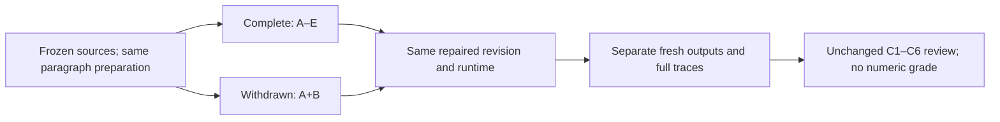

# Does the causal claim depend on the decisive evidence?

Design-only preregistration, 2026-10-09; continuous-light. Proposed CONTROL-004 is a new pair, not a fourth CONTROL-003 attempt. No model calls, execution, adoption or readiness promotion is authorized by this document.

Question, verbatim: **Why did Morton Thiokol reverse its recommendation against launching STS-51L under the forecast cold conditions and recommend proceeding with the 28 January 1986 launch?**

The decision is bounded v1 research-demo readiness. The unit is one recommendation reversal in one complete/withdrawn pair; no population estimate. [Current goal](https://github.com/BrianMills2718/process_tracing/blob/1b130214a084b4d18cd9ccc60adbfe0dc477f7e0/docs/GOAL.md) and [repair status](https://github.com/BrianMills2718/process_tracing/blob/1b130214a084b4d18cd9ccc60adbfe0dc477f7e0/docs/CURRENT_STATUS.md) remain authority. Historical failures remain failed.

| Arm | Evidence supplied | Required contrast |
| --- | --- | --- |
| Complete | Frozen sources A–E, with the already repaired paragraph preparation | Recover management replacing engineering consensus, engineers opposing without being polled, and the burden shifting to proving the launch unsafe. |
| Withdrawn | Exactly the same prepared A+B bytes; remove C, D and E | Weaken or withhold the internal-caucus mechanism; removed details cannot become observed corpus facts. |

**Freeze.** Both arms run executable Process Tracing revision `1b130214a084b4d18cd9ccc60adbfe0dc477f7e0`, shared llm_client revision `b88800c59ede535f8ddf45eccad398db8267e082`, through `make run`: `openrouter/openai/gpt-5.6-luna`, medium reasoning, bounded default mechanism audit, one terminal repair, normal `exploratory_full_corpus`, $0.65 per arm. No theory, hypotheses, priors, paper or comparison key enter either runner. Capture the separately committed protocol revision, effective prompts/schemas, role routes, configuration and runtime identity before dispatch; refuse mismatches rather than substitute a newer revision.

**Inputs.** [Original freeze and exact C1–C6](https://github.com/BrianMills2718/process_tracing/blob/1b130214a084b4d18cd9ccc60adbfe0dc477f7e0/docs/evaluations/control003_challenger_20261008.json) owns the unchanged primary records, source limitations, question and comparator. [Paragraph correction](https://github.com/BrianMills2718/process_tracing/blob/1b130214a084b4d18cd9ccc60adbfe0dc477f7e0/docs/evaluations/control003_challenger_corrective_20261008.json) preserves every non-whitespace source character within original HTML blocks. The original withdrawn layout cannot be paired with the corrected complete layout.

Complete is frozen `input_text/control003_challenger/complete_paragraphs.txt`, SHA-256 `7cb89cb71b5b73dcd566b0af58c216398fb6ee8ef2b16a86d809e3b4b3a525f8`. Withdrawn is its raw byte prefix ending immediately before the first exact `[Source source_c]\n` header, including the preceding separator: 13,414 bytes, SHA-256 `edfd80c5f484400f5484b305cc2c2abea76baf3d8ac595ad64a971b9324d48f0`. This is a deterministic source selection, not a text rewrite. Use original complete/withheld source packets, SHA-256 `8d47ce7eec90dd4c2d05a71e83f9bf4566cac7d59c31a1fd0bc2502a9bf4cbd7` / `2395bd4fd830966f1d16a88897f18c788bf0aed11c59a2ba11bf9366abad3fbf`. The unchanged criterion object has SHA-256 `967780ace2e099614ab3030698234ab03d5ac7855e5a715a670acfe40054562d` (sorted-key compact UTF-8 JSON, non-ASCII preserved).

**Comparator.** Romzek & Dubnick (1987), *Accountability in the Public Sector: Lessons from the Challenger Tragedy*, PAR 47(3), 227–238, DOI 10.2307/975901; printed p.234/PDF p.8, managerial caucus and changed decision basis only. Paper, this protocol, answer key and historic graphs/traces are reviewer-only and excluded from runner context. Primary testimony is retrospective, commonly from one hearing, and contains conflicting recollections and question premises; the final fax explicitly requires oral discussion.

**Readout.** Preserve the exact C1–C6 pass/borderline/fail definitions by reference, without tuning: C1 proximate mechanism, C2 chronology, C3 fair rival, C4 unsupported claims, C5 source custody/limits, C6 withdrawal. Report each separately; overall pass requires all six. Unsupported chronology must name its missing dated transition, distinguish deliberation on 27 January, planned launch on 28 January and retrospective testimony on 25 February, and retain genuinely unstated dates. Do not require exact timestamps where a source supports only relative ordering. Chronology, unchanged priors or audit acceptance cannot replace a missing causal step.

**Trace custody.** Allocate fresh per-arm root trace IDs and output directories; no historical resume or cached analysis. Retain ordered tool arguments/results, rendered prompts, response schemas, raw and parsed responses, model/task/trace IDs, provider errors, spend/timing, stage inputs/outputs, candidate graphs, critiques, bounded repair ledger, accepted lineage and source references. Verify completeness before readout. Read every failing or surprising item end to end and sample passes; classify failures as evidence never returned, returned but unused, or an incorrect expected answer. A key conflict is reported without relaxing this freeze; later reinterpretation is exploratory.

**Stops and validity.** Exactly one fresh complete arm and one fresh withdrawn arm; run complete then withdrawn, with no outcome-dependent rerun, added repair pass or corrective allowance. Preserve every failure. Native accepted, blocked_by_native_gate, failed_to_produce_analysis and invalid_execution states are distinct; blocked/failed runs limit readiness, and unproduced outputs are unassessable. Wrong source bytes, key leakage, configuration/runtime mismatch, unavailable provider/runtime or missing traces invalidate the affected observation. No hand-authored substitute, unrelated cached report or fixture-only screen can stand in for a run. Structural checks do not judge causal truth.

**Cost and separate approval.** Historical corrected-complete plus withdrawn attempts used 29 calls and $0.13684211, but neither finished; this is observed incomplete-path cost, not a full-pair forecast. Full completion on richer context is unmeasured. Proposed ceiling is $1.30 total with the unchanged $0.65 per-arm cap. Before execution, obtain explicit approval for this new pair and ceiling, adopt its execution plan, refresh current spend/concurrent reservations through native observability, and verify exact inputs, runtime, trace capture and normal entrypoint configuration. No old assessment, monthly allowance or planning-only approval supplies that authority; no spend occurs in this design phase.

**Limits.** This case informed the repairs and is not held out. Famous-case pretraining contamination cannot be excluded; withdrawal probes unsupported recall, not model ignorance. One selected case establishes neither representative performance, model superiority, calibrated historical probability, private motives, the full accident mechanism nor general autonomous research. Honest failure completes the pair's assessment without establishing scientific readiness. No human review, hosted CI, new architecture, benchmark or passing control gates completion of this preregistration.

Recorded design evidence: [exact bindings and source checks](bindings.json), [writing situation/checklist](PROTOCOL.md.writing.json), [representation recommendation](recommendation.json) and [disposition](disposition.json). Renderer and reader-perception checks are explicitly unexecuted; no finished UI or human comprehension is claimed.
